# Xubuntu Wallpapers

| Release | Wallpaper(s) | Author |
| ------- | ------------ | ------ |
| 6.06    |  | Jozsef Mak |
| 6.10    |  | Jozsef Mak |
| 7.04    |  | Jozsef Mak |
| 7.10    |  | Jozsef Mak |
| 8.04    |  | Jozsef Mak |
| 8.10    |  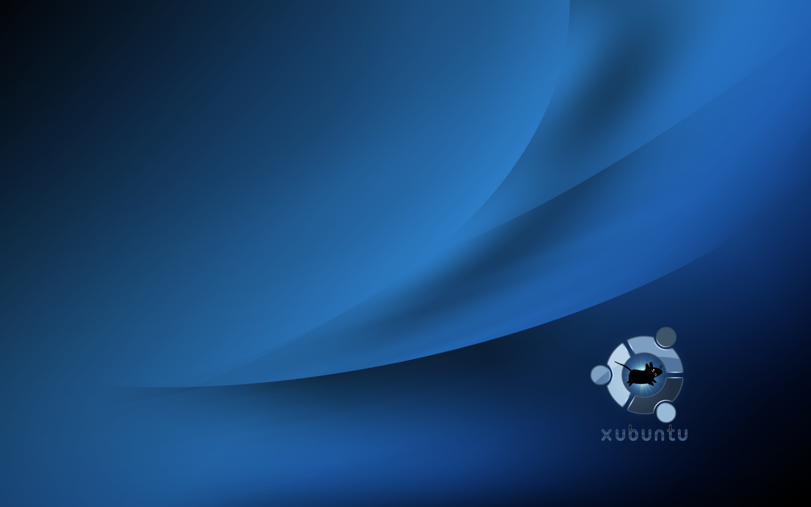 | Jozsef Mak |
| 9.04    | 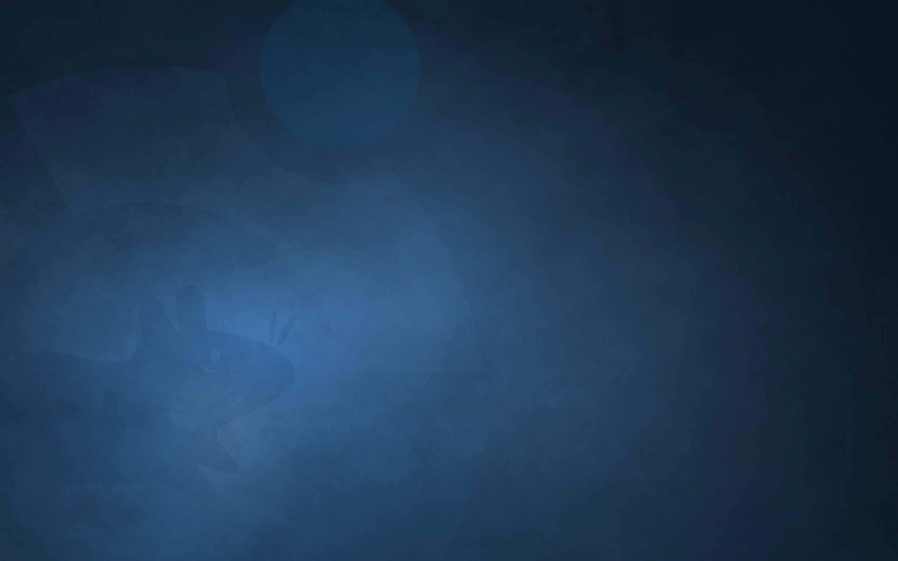 | Pasi Lallinaho |
| 9.10    | 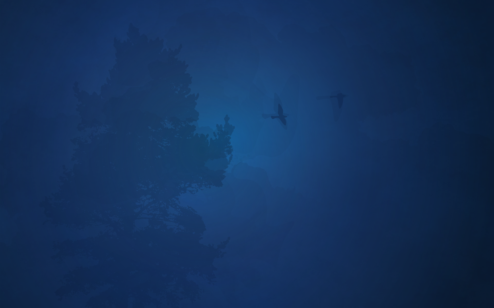 | Pasi Lallinaho |
| 10.04   | 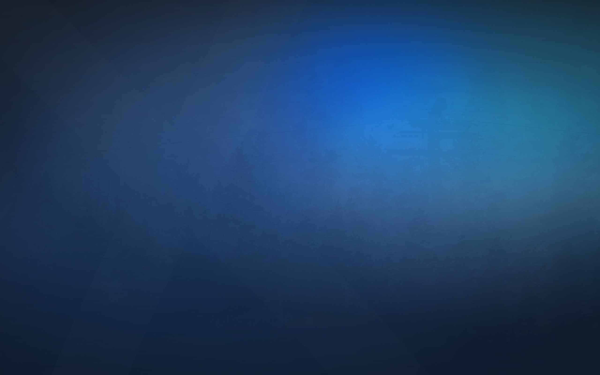 | Pasi Lallinaho |
| 10.10   | 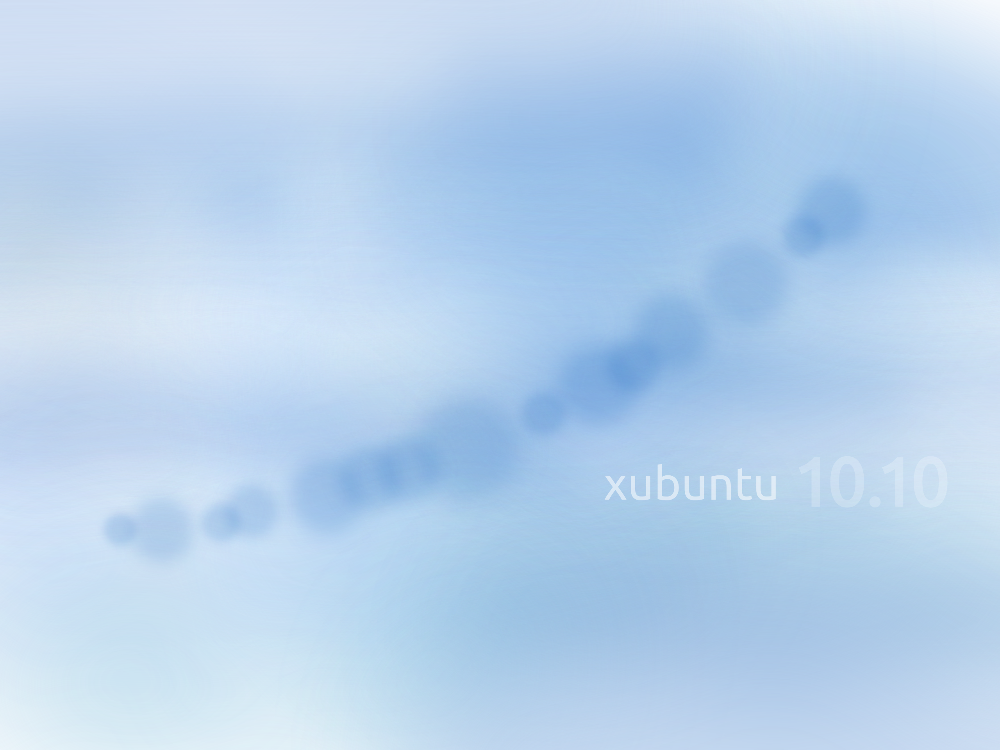 | Pasi Lallinaho |
| 11.04   | 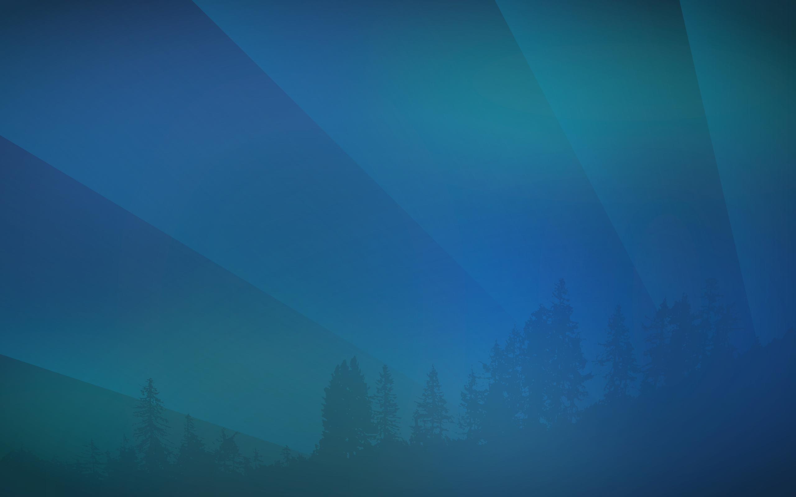 | Pasi Lallinaho |
| 11.10   | No new wallpaper |
| 12.04   |  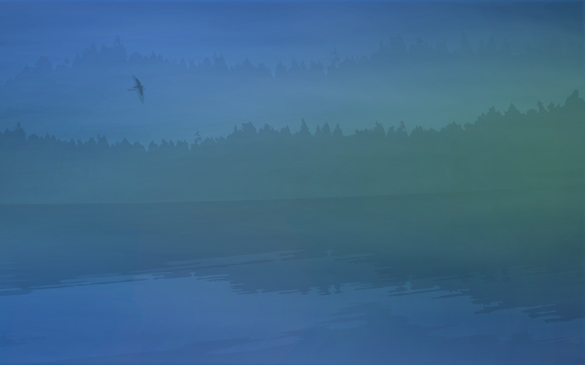 | Pasi Lallinaho |
| 12.10   |  | Pasi Lallinaho |
| 13.04   | 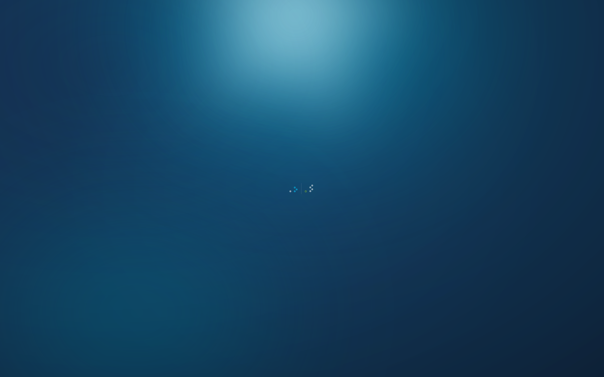 | Pasi Lallinaho |
| 13.10   | 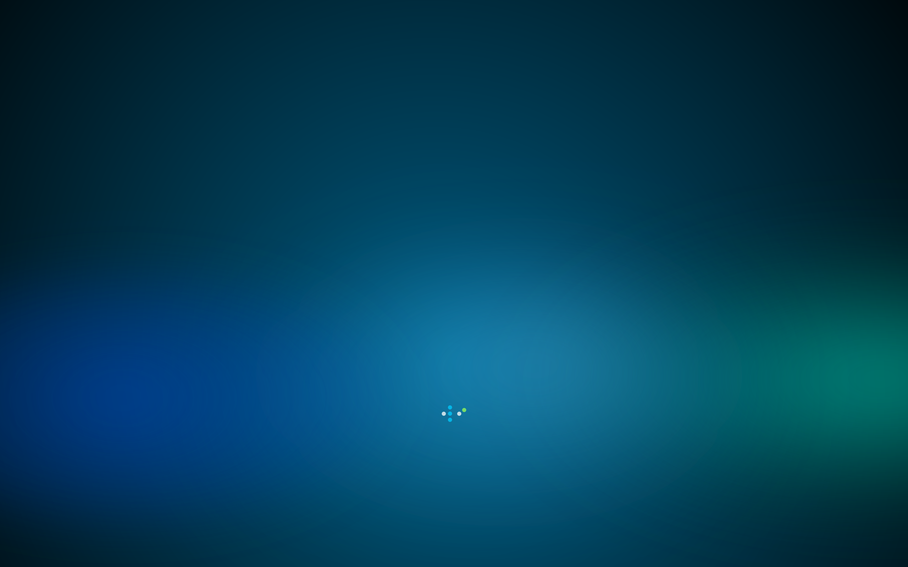 | Pasi Lallinaho |
| 14.04   | 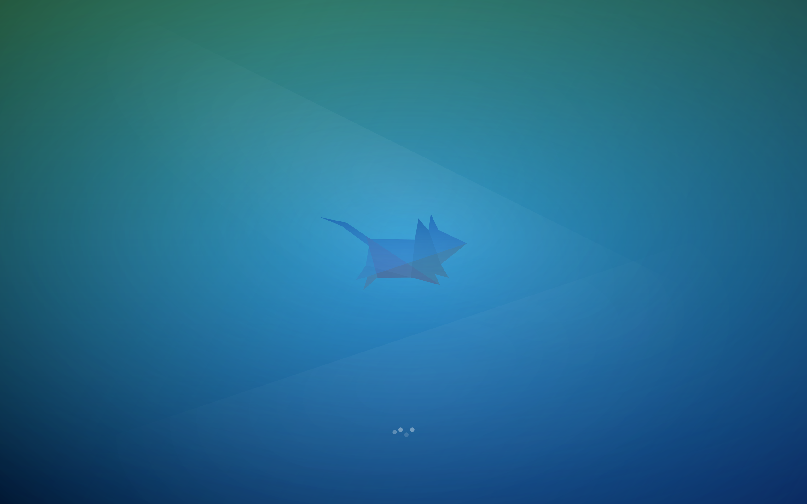 | Pasi Lallinaho |
| 14.10   |  | Pasi Lallinaho |
| Development | 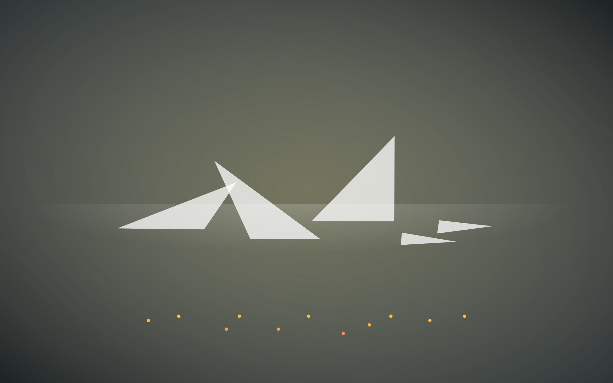 | Pasi Lallinaho |
| 15.04   | 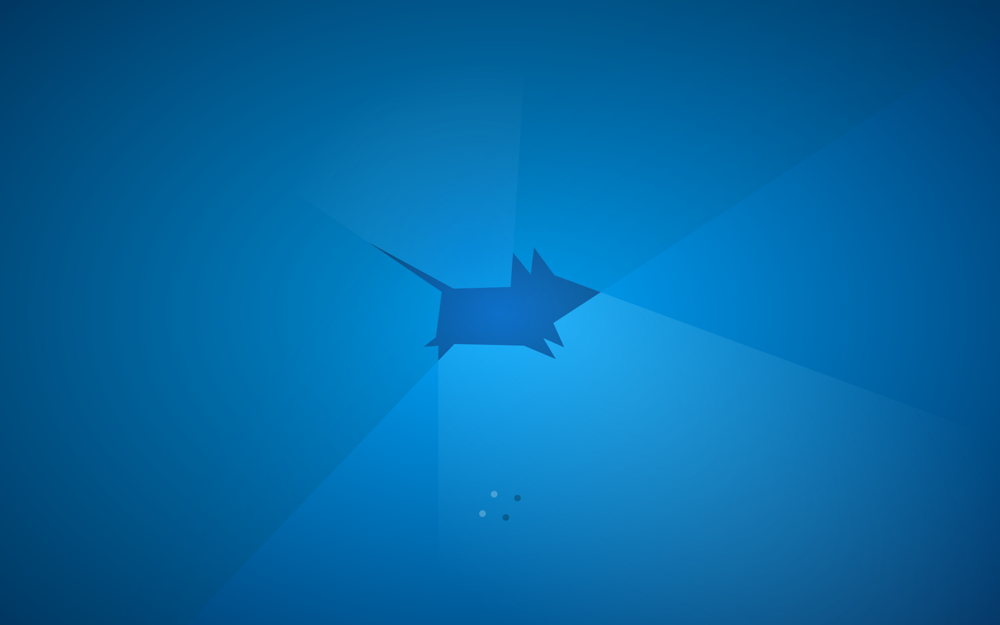 | Pasi Lallinaho |
| 15.10   |  | Pasi Lallinaho |
| 16.04   |  | Pasi Lallinaho |
| 16.10   |  | Pasi Lallinaho |
| 17.04   |  | Pasi Lallinaho |
| 17.10   |  | Pasi Lallinaho |
| 18.04   |  | Pasi Lallinaho |
| 18.10   |  | Pasi Lallinaho |
| 19.04   |  | Pasi Lallinaho |
| 19.10   |  | Pasi Lallinaho |
| 20.04   |  | Pasi Lallinaho |
| 20.10   | No new wallpaper |
| 21.04   |  | Pasi Lallinaho |
| 21.10   |  | Pasi Lallinaho |
| 22.04   |  | Pasi Lallinaho |
